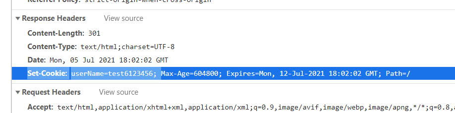
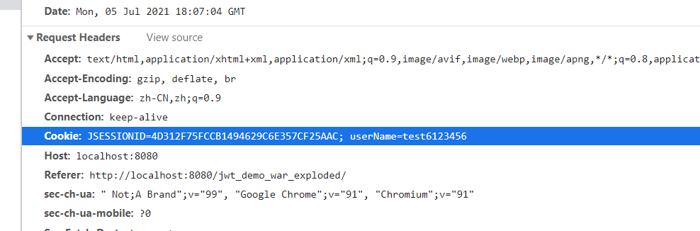

<h3 style="color:red;text-align:center">乐之者java: http://www.roadjava.com/ 制作</h3>

<h1 style="color:orange;text-align:center">jwt实战与原理</h1>

### 一、cookie与session

​		服务端向浏览器第一次写入cookie的时候，会额外写入名为JSESSIONID的cookie



​		之后每次请求都会携带浏览器端的所有的cookie：


​	

### 二、为什么需要jwt

cookie和session的缺点:

* session都存储在服务端内存

* 集群环境中需要额外处理。ip_hash,分布式session.....

  user -> a1,a2,a3

* csrf : Cross-site request forgery  ，cookie被截获后可能发生跨站点请求伪造

* cookie的跨域（前后端分离）读写不方便

jwt的优点:

解决了上面cookie和session的缺点，主要应用在前后端分离的场景、当然你用在单体应用里面也是没有问题

### 三、jwt的实现方式

jwt: json web token,任何编程语言都可以用

官网:  https://jwt.io/

token: 令牌,字符串

#### 3.1 java-jwt

#### 3.2 jjwt

引入依赖:

```xml
   <dependency>
      <groupId>io.jsonwebtoken</groupId>
      <artifactId>jjwt</artifactId>
      <version>0.9.0</version>
    </dependency>
```


### 四、前后端交互

#### 4.1 后端工具类

#### 4.2 后端返回token

跨域参考： https://www.bilibili.com/video/BV1Eq4y1E7hw?p=75

#### 4.3 前端存储token

spa(single page application) :  sessionStorage

localStorage

#### 4.4 前端传递的方式

前端存储token后，干嘛呢？之后每次请求都携带这个token，用于让服务端校验。

* Authorization : 授权
* 请求参数里面，参数名字无所谓，一般的都叫做token

两者可以选择使用

#### 4.5 后端接收与校验

* 注意一：==预检请求的问题==

  对于非简单的ajax请求，ajax会先发送一个OPTIONS的preflight request预检请求，用来获取服务端响应头信息，比如

  CorsFilter里面设置的响应头，浏览器判断返回的响应头，如果接下来的实际请求不被允许，那就不再发送，反之则

  执行发送真正的请求。

  简单的ajax请求必须满足以下条件：

  ```plain
  1. 请求的method只能是get、post、options
  2. 请求头，除了浏览器自带如User-Agent,还允许自行添加的范围：Accept、Content-Type
  3. Content-Type的取值只能是：text/plain、multipart/form-data、application/x-www-form-urlencoded
  ```

* 注意二：==filter执行顺序的问题==

### 五、jwt原理

#### 5.1 jwt的组成

Header.Payload.Signature

##### 5.1.1 header

原始内容originalHeader:

```json
{
  "alg": "HS256",
  "typ": "JWT"
}
```

=>base64UrlEncode(originalHeader)=>header

##### 5.1.2 payload

原始内容originalPayload:

```json
{
  "userInfo":"{\"addr\":\"河南\",\"id\":99,\"name\":\"aaa\"}"
}
```

=>base64UrlEncode(originalPayload)=>payload

##### 5.1.3 signature

salt:盐

```code
base64UrlEncode(HMACSHA256(
  base64UrlEncode(header) + "." +
  base64UrlEncode(payload),
  secret))
```

#### 5.2 手写jwt算法


